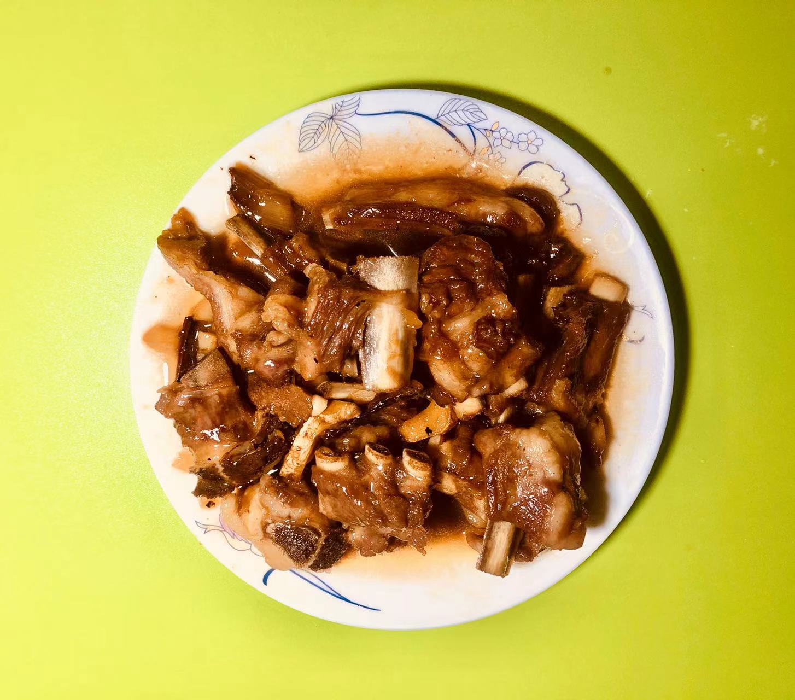

# 红烧排骨的做法

[红烧排骨](https://baike.baidu.com/item/%E7%BA%A2%E7%83%A7%E6%8E%92%E9%AA%A8/31894)是一道常见菜肴。以猪排骨、杏鲍菇作为主要食材，以干辣椒、花椒、八角、丁香、姜片、盐、老抽、生抽、料酒、冰糖等作为辅料制作而成。此菜味道香咸，排骨酥烂，色泽金红。男女老少皆可食用。

## 必备原料和工具

* 排骨
* 白砂糖
* 食用油
* 生抽
* 蚝油
* 老抽
* 鸡精
* 姜片
* 葱花
* 姜片
* 桂皮
* 柠檬（可选）
* 可乐（可选）

## 计算

每份：

* 排骨 300 g
* 白砂糖 20 g
* 食用油  350 ml
* 生抽 5 ml
* 蚝油 5 ml
* 老抽 5 ml
* 鸡精 2 g
* 姜片 2 片
* 桂皮 2 片

## 操作

* 准备好佐料;
* 排骨+姜片+料酒冷水下锅，煮开后用勺子舀去白色油沫，2-3 分钟后出锅去沫;
* 冷水清洗排骨，清洗 2-3 遍;
* 锅中加入 300 ml 食用油，放入姜片、葱花，拌炒,香味炒出，倒入排骨，倒入香醋、生抽、蚝油、鸡精,翻炒，上色调色;
* 倒入开水（不要放凉水）, 高出排骨 1-2cm 即可。大火烧开,焖烧 10-15 分钟,上色入味;
* 普通锅小火煮 20 分钟，高压锅 8-10 分钟;
* 大火收汁,放盐,生抽再次调色;
* 排骨夹入盘子,佐料夹出扔掉,继续加热搅拌浓汁 1 分钟;
* 缓慢倒在排骨上，可放入少许葱花、芝麻装点。

## 附加内容

* 不要用凉水大火烧开;
* 放老抽调色就不用冰糖调色了;
* 烧汁过程中，可以根据汤汁酸甜度选择再加 3-5 g 白砂糖、2-5 ml 香醋、生抽。

## 参考

* [王刚懒人排骨](https://b23.tv/2h4YLbz)
* [老饭骨家庭版红烧排骨](https://b23.tv/rQSxnRi)

如果您遵循本指南的制作流程而发现有问题或可以改进的流程，请提出 Issue 或 Pull request 。
